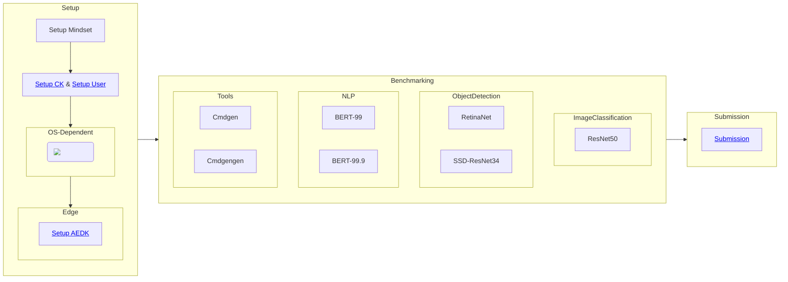

| Setup    | Benchmarking       | Submission |
| ------------------------ | ------------------------ | ------------------------ |
|  |  | |
 

<!--Diagram Start-->

<!--Diagram End-->

Here is the diagram of the whole process:

