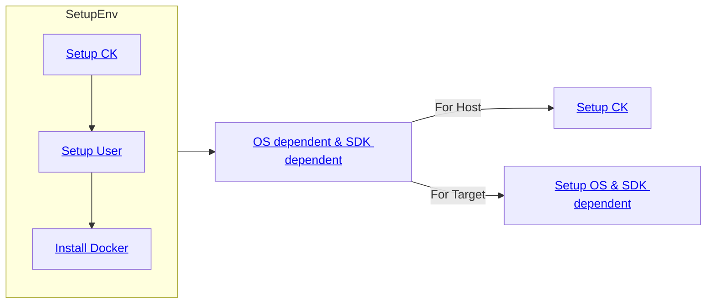

# Quick Setup With Docker :material-docker: 

- [ ] Add mandatory and optional parameters note here
   - idea1: highlight those parameters



## Setup CK :material-tools:
Please install Collective Knowledge (`ck`) and the `ck-qaic` package, if it hasn't been done.

=== "ck-qaic"
    <pre><code>pip install ck
    ck pull repo --url=http://github.com/krai/ck-qaic.git
    </code></pre>
    

=== "developer (ck-qaic-dev-krai)"
    <pre><code>pip install ck
    ck pull repo --url=http://github.com/krai/ck-qaic-dev-krai.git</code></pre>
    

## Setup User :fontawesome-solid-user-gear:

=== "ck-qaic"
    <pre><code>cd $(ck find repo:ck-qaic)/script/setup.docker
    WORKSPACE_DIR=<a style="background-color:yellow;">/local/mnt/workspace</a> bash setup_user.sh
    </code></pre>
    
=== "developer (ck-qaic-dev-krai)"
    <pre><code>cd $(ck find repo:ck-qaic)/script/setup.docker
    <a style="font-weight: bold;">WORKSPACE_DIR</a>=<a style="background-color:yellow;">/local/mnt/workspace</a> bash setup_user.sh</code></pre>
    

## Setup CK

=== "ck-qaic"
    <pre><code>cd $(ck find repo:ck-qaic)/script/setup.docker
    <a style="font-weight: bold;">WORKSPACE_DIR</a>=<a style="background-color:yellow;">/local/mnt/workspace</a> CK_QAIC_REPO=ck-qaic-dev-krai bash setup_ck.sh</code></pre>
    
=== "developer (ck-qaic-dev-krai)"
    <pre><code>cd $(ck find repo:ck-qaic)/script/setup.docker
    WORKSPACE_DIR=<a style="background-color:yellow;">/local/mnt/workspace</a> CK_QAIC_REPO=ck-qaic-dev-krai bash setup_ck.sh</code></pre>
    

## Install Docker :material-docker: 

=== "ck-qaic"
    Go to the following directory as base for Docker Setup.
    <pre><code>cd $(ck find repo:ck-qaic)/script/setup.docker
    </code></pre>
    <div class="result" markdown>
    === "CentOS 7"
        ``` bash
        WORKSPACE_DIR=/local/mnt/workspace \
        bash setup_centos.sh
        ```
    === "Ubuntu 20.04"
        ``` bash
        WORKSPACE_DIR=/local/mnt/workspace \
        bash setup_ubuntu.sh
        ```
    </div>
    !!! note "Login again"
        Re login for the necessary group permissions to take effect. (Check if it works for tmux)

=== "developer (ck-qaic-dev-krai)"
    Go to the following directory as base for Docker Setup.
    <pre><code>cd $(ck find repo:ck-qaic)/script/setup.docker
    </code></pre>
    <div class="result" markdown>
    === "CentOS 7"
        ``` bash
        WORKSPACE_DIR=/local/mnt/workspace \
        bash setup_centos.sh
        ```
    === "Ubuntu 20.04"
        ``` bash
        WORKSPACE_DIR=/local/mnt/workspace \
        bash setup_ubuntu.sh
        ```
    </div>
    !!! note "Login again"
        Re login for the necessary group permissions to take effect. (Check if it works for tmux)

    

## OS dependent & SDK dependent

!!! note "About the OS"
    We recommend to use the same OS to satisfy MLPerf requirements.

### For Host: Set up Collective Knowledge environment :material-tools:

=== "ck-qaic"
    ```
    WORKSPACE_DIR=/local/mnt/workspace \
    bash setup_ck.sh
    ```

=== "developer (ck-qaic-dev-krai)"
    ```
    WORKSPACE_DIR=/local/mnt/workspace \
    bash setup_ck.sh
    ```
    
### For Target: Set up OS dependent, SDK dependent

=== "Quick Setup :material-docker:"
    !!! info inline end 
        Make sure to have copied the required datasets (e.g. ImageNet) and SDKs to `$WORKSPACE/datasets` and `$WORKSPACE/sdks`, respectively.
    <pre><code>WORKLOADS=ssd-resnet34,ssd-mobilenet \
    COMPILE_PRO=no \
    COMPILE_STD=yes \
    PRECALIBRATED_PROFILE=no \
    DOCKER_OS=ubuntu \
    SDK_DIR=/data/qaic/<a vartag='SDK_VER'>1.8.2.10</a> \
    SDK_VER=<a vartag='SDK_VER'>1.8.2.10</a> \
    TIMEZONE=Europe/London \
    bash setup_images.sh
    </code></pre>

    ??? example "Arguments"

        - Use `WORKLOADS=resnet50,retinanet,ssd-resnet34,ssd-mobilenet` to select models. Default: `WORKLOADS=resnet50,retinanet`

        - Use `COMPILE_PRO=yes COMPILE_STD=no` or `COMPILE_PRO=no COMPILE_STD=yes` to compile for PCIe Pro and PCIe Standard server cards, respectively.
        Default: `COMPILE_PRO=yes COMPILE_STD=no`

        - Use `PRECALIBRATED_PROFILE=yes` to use a precalibrated profile and `PRECALIBRATED_PROFILE=no` to calibrate the workload from scratch. Default: `PRECALIBRATED_PROFILE=yes`

        TODO: Addtesting + [other workloads](https://github.com/krai/ck-qaic-dev-krai/tree/main/script/setup.docker#further-info)

    
    
=== "Slow Setup :material-docker:"
    